# CRAX: Constrained Reinforcement Learning Accelerated with JAX

CRAX is a high-performance benchmark for **Constrained Reinforcement Learning (Safe RL)** built on top of [Brax](https://github.com/google/brax) and [MuJoCo XLA (MJX)](https://mujoco.readthedocs.io/en/stable/mjx.html). It provides GPU/TPU-accelerated environments with safety constraints and a suite of state-of-the-art safe RL algorithms.

<p align="center">
  
</p>

## Features

- **Massively parallel simulation**: Train agents across thousands of environments simultaneously on GPU/TPU
- **Configurable difficulty levels**: Environments with varying numbers and types of hazards
- **Multiple constraint types**: Cylindrical hazards, cubical hazards, boundary constraints, velocity limits, and more
- **State-of-the-art algorithms**: Implementations of leading constrained RL methods

## Safe RL Algorithms

CRAX includes efficient JAX implementations of the following, selected with the
`--alg` flag:

| Algorithm | Flag | Description | Reference |
|-----------|------|-------------|-----------|
| **PPO** | `ppo` | Vanilla PPO (unconstrained on-policy baseline) | [Schulman et al., 2017](https://arxiv.org/abs/1707.06347) |
| **PPO-Cost** | `ppo_cost` | PPO with a cost penalty folded into the reward | |
| **PPO-Lagrange** | `ppo_lag` | PPO with Lagrangian relaxation for constraints | [Ray et al., 2019](https://cdn.openai.com/safexp-short.pdf) |
| **PPO-PID** | `ppo_pid` | PPO with PID-controlled Lagrange multiplier | [Stooke et al., 2020](https://arxiv.org/abs/2007.03964) |
| **PPO-Saute** | `ppo_saute` | State Augmentation for Safe RL | [Sootla et al., 2022](https://arxiv.org/abs/2202.06558) |
| **FOCOPS** | `focops` | First Order Constrained Optimization in Policy Space | [Zhang et al., 2020](https://arxiv.org/abs/2002.06506) |
| **P3O** | `p3o` | Penalized Proximal Policy Optimization | [Zhang et al., 2022](https://arxiv.org/abs/2205.11814) |
| **CRPO** | `crpo` | Constrained Rectified Policy Optimization | [Xu et al., 2021](https://arxiv.org/abs/2011.05869) |
| **SAC** | `sac` | Soft Actor-Critic (unconstrained off-policy baseline) | [Haarnoja et al., 2018](https://arxiv.org/abs/1801.01290) |
| **SAC-Lagrange** | `sac_lag` | SAC with Lagrangian relaxation for constraints | |
| **SAC-PID** | `sac_pid` | SAC with PID-controlled Lagrange multiplier | |

All algorithms share a common training infrastructure with hooks for custom loss functions and constraint handling, making it easy to implement new methods. The registry lives in `get_algorithm_train_fn` in `run_utils.py`; each algorithm adds its own CLI section in `configs/training_config.py` (`--safety_bound`, `--pid_kp`, `--nu_lr`, `--tau`, ...), and irrelevant arguments are filtered out per algorithm by `filter_kwargs_for_fn`.

## Environments

CRAX environments follow a **task-agent** naming convention: `safe_<task>_<agent>`.

| Task | Agents Supported                                      | Description                                              |
|------|-------------------------------------------------------|----------------------------------------------------------|
| **Goal** | Point, Ant, Spider, Humanoid, Swimmer                 | Navigate to goal positions while avoiding hazards        |
| **Circle** | Point, Ant, Spider, Humanoid, Swimmer                 | Orbit a circular path within boundaries                  |
| **Button** | Point, Ant, Spider, Humanoid, Swimmer                 | Press target buttons while avoiding gremlins and hazards |
| **Push** | Point, Ant, Spider, Humanoid, Swimmer                 | Push a block to a goal while avoiding hazards            |
| **Velocity** | Ant, Humanoid, HalfCheetah, Hopper, Swimmer, Walker2D | Locomotion under maximum velocity constraints            |
| **Lift** | Ant, Humanoid, Spider                                 | Locomotion with restricted legs touching the floor        |
| **Height** | Humanoid, HalfCheetah, Hopper, Walker2D               | Locomotion under a height ceiling                        |
| **Pathway** | HalfCheetah, Hopper, Walker2D                         | Traverse a corridor with hazard gaps                     |
| **Reacher** | Reacher                                               | Robotic arm reaching targets while avoiding obstacles    |

## Difficulty Levels

Every environment offers three difficulty levels that progressively increase constraint difficulty.

| Environment | Level 1 | Level 2 | Level 3 |
|:-----------:|:-------:|:-------:|:-------:|
| **Goal** | 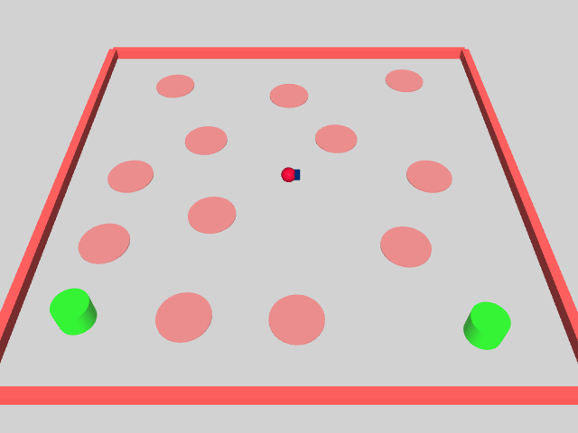 | 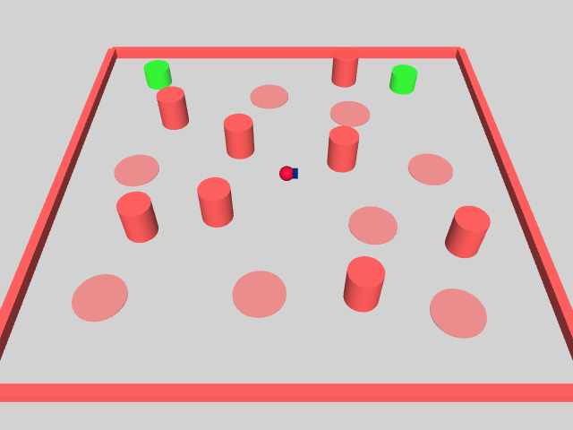 | 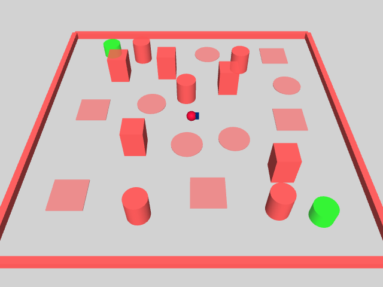 |
| **Circle** | 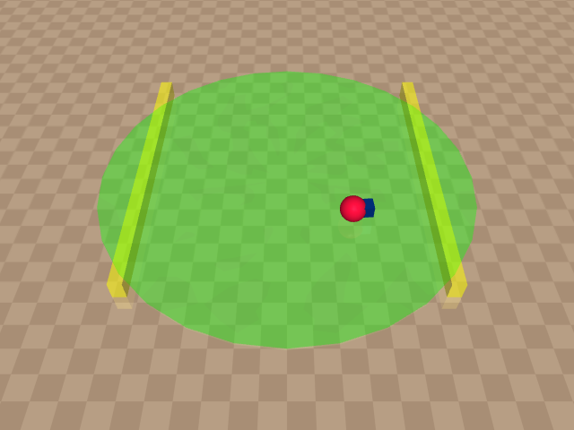 | 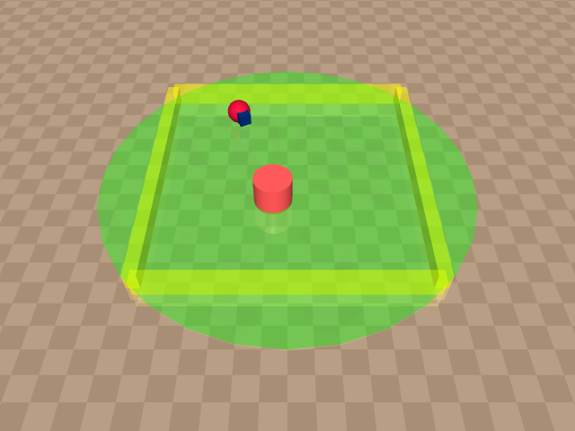 | 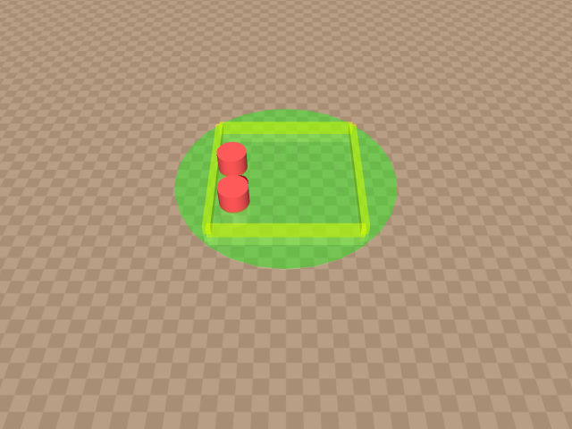 |
| **Push** | 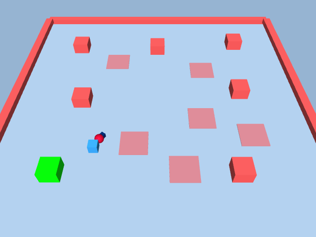 | 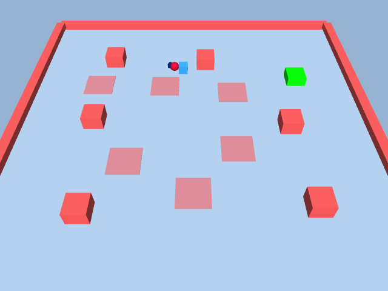 |  |
| **Reacher** | 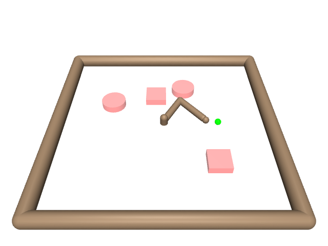 | 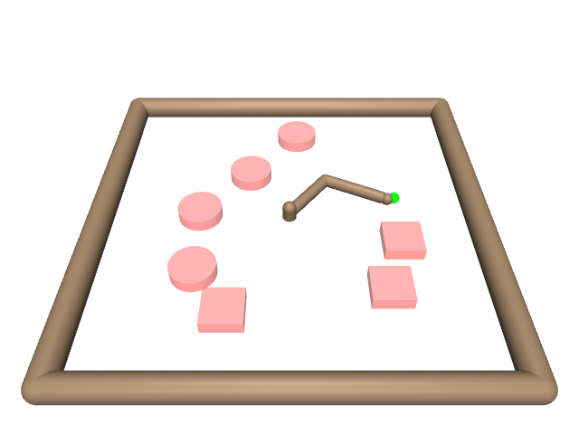 | 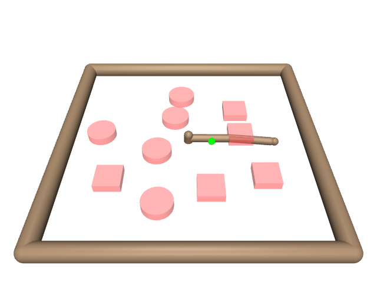 |
| **Pathway** |  | 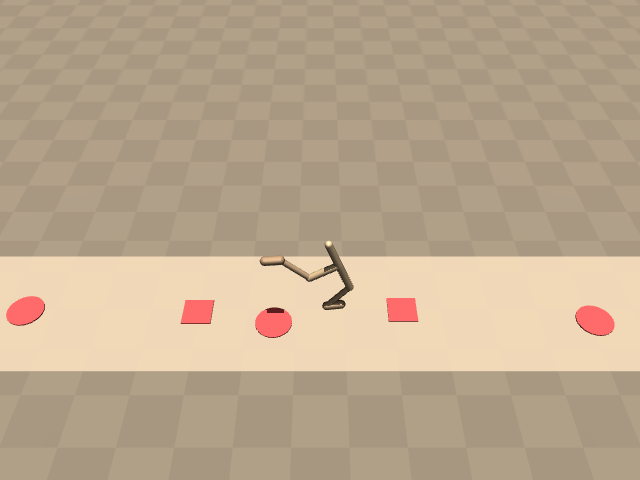 |  |
| **Height** |  | 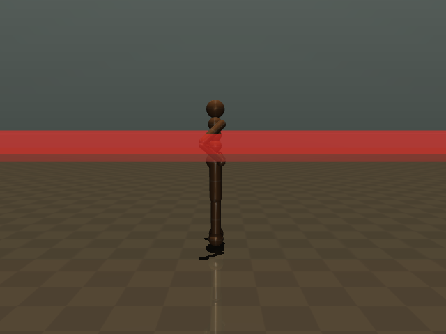 | 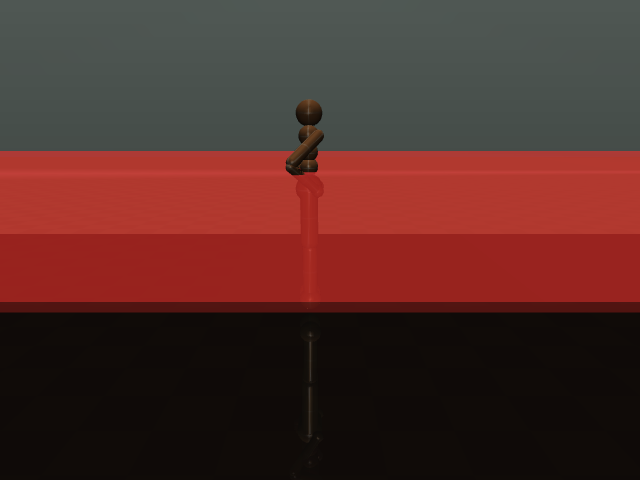 |
| **Lift** |  |  |  |

## Installation

```bash
git clone https://github.com/TTomilin/CRAX.git
cd CRAX
```

Create and activate a virtual environment using your preferred tool:

```bash
# Option A: venv
python3 -m venv .venv && source .venv/bin/activate

# Option B: conda
conda create -n crax python=3.11 && conda activate crax
```

Then install the package:

```bash
pip install -e .
```

For GPU support (CUDA 12), install the `cuda` extra instead, which pulls in `jax[cuda12]`:

```bash
pip install -e ".[cuda]"
```

See [SETUP.md](SETUP.md) for pinned installs, GPU/headless configuration, wandb
and troubleshooting, and [docs/VISION_TRAINING.md](docs/VISION_TRAINING.md) for
training from pixel observations.

## Quick Start

### Training an agent

```python
from crax import envs
from crax.training.agents.ppo_lag import train as ppo_lag_train

# Create environment
env = envs.get_environment('safe_goal_point', level=1)

# Train with PPO-Lagrange
make_policy, params, metrics, _ = ppo_lag_train.train(
    environment=env,
    num_timesteps=10_000_000,
    episode_length=1000,
    num_envs=2048,
    safety_bound=25.0,  # Maximum allowed cost per episode
    lagrangian_coef_rate=0.01,
)
```

### Using the CLI

```bash
# Single environment training
python train_env.py --env_name safe_goal_point --alg ppo_lag --difficulty 1

# Curriculum training (progressive difficulty)
python train_curriculum.py --env_name safe_goal_point --alg ppo_lag

# Safety transfer (pre-train with PPO, then fine-tune with safe algorithms)
python train_transfer.py --env_name safe_velocity_ant --alg ppo_lag
```

## Project Structure

```
CRAX/
├── crax/
│   ├── envs/                    # Environment definitions
│   │   ├── safe_goal.py         # Goal navigation suite
│   │   ├── safe_circle.py       # Circular orbit suite
│   │   ├── safe_button.py       # Button pressing suite
│   │   ├── safe_push.py         # Block pushing suite
│   │   ├── safe_velocity.py     # Velocity constraint suite (6 agents)
│   │   ├── safe_lift.py         # Leg-lifting suite
│   │   ├── safe_height.py       # Height constraint suite
│   │   ├── safe_pathway.py      # Hazard corridor suite
│   │   ├── safe_reacher.py      # Reacher with obstacles
│   │   ├── builder.py           # Modular XML scene builder
│   │   ├── difficulty.py        # Difficulty level configurations
│   │   ├── hazards.py           # Hazard generation utilities
│   │   ├── goals.py             # Goal sampling utilities
│   │   └── wrappers/            # Env wrappers (incl. pixel observations)
│   └── training/
│       ├── curriculum.py        # Curriculum training loop
│       ├── transfer.py          # Transfer learning loop
│       └── agents/
│           ├── ppo/             # Base PPO with extensibility hooks
│           ├── ppo_lag/         # PPO-Lagrange
│           ├── ppo_pid/         # PPO with PID controller
│           ├── ppo_saute/       # Saute wrapper
│           ├── focops/          # FOCOPS
│           ├── p3o/             # P3O
│           ├── crpo/            # CRPO
│           ├── sac/             # SAC
│           ├── sac_lag/         # SAC-Lagrange
│           └── sac_pid/         # SAC-PID
├── configs/training_config.py   # Shared CLI argument definitions
├── docs/VISION_TRAINING.md      # Pixel-observation training guide
├── train_env.py                 # Single environment training
├── train_curriculum.py          # Progressive difficulty training
├── train_transfer.py            # Safety transfer learning
├── run_utils.py                 # Shared training helpers
├── scripts/                     # Utility & visualization scripts
└── tests/                       # Pytest suite
```

## Architecture

CRAX uses a modular architecture where constrained RL algorithms are wrappers around a base RL algorithm, e.g.:

```
ppo/train.py          # Base trainer with hooks (loss_fn, post_step_fn, init_aux_state_fn)
    │
    ├── ppo_lag/      # Lagrange multiplier update + lagrange loss
    ├── ppo_pid/      # PID controller + lagrange loss
    ├── focops/       # FOCOPS loss + nu update
    ├── p3o/          # P3O loss + kappa adaptation
    ├── ppo_saute/    # Environment wrapper approach
    └── crpo/         # Rectified reward/cost objective switching
```

This design minimizes code duplication and makes it easy to add new algorithms.

## Acknowledgements

CRAX builds on [Brax](https://github.com/google/brax), Google's JAX-based
physics and RL library, and on [MuJoCo XLA (MJX)](https://mujoco.readthedocs.io/en/stable/mjx.html)
and [MuJoCo Warp](https://github.com/google-deepmind/mujoco_warp), which power
the accelerated simulation and the GPU pixel renderer. We thank the Brax and
MuJoCo teams for these foundations.

Our navigation suite tasks are close reimplementations from
[Safety Gym](https://openai.com/index/safety-gym/) and
[Safety-Gymnasium](https://github.com/PKU-Alignment/safety-gymnasium).

## Citation

If you use CRAX in your research, please cite:

```bibtex
@article{tomilin2026crax,
  title         = {CRAX: Fast Safe Reinforcement Learning Benchmarking},
  author        = {Tristan Tomilin and Mourad Boustani and Mickey Beurskens and Thiago D. Sim{\~a}o},
  journal       = {arXiv preprint arXiv:2606.20376},
  year          = {2026}
}
```
